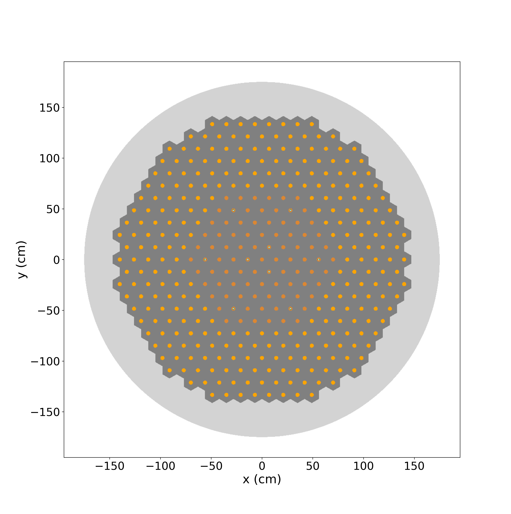
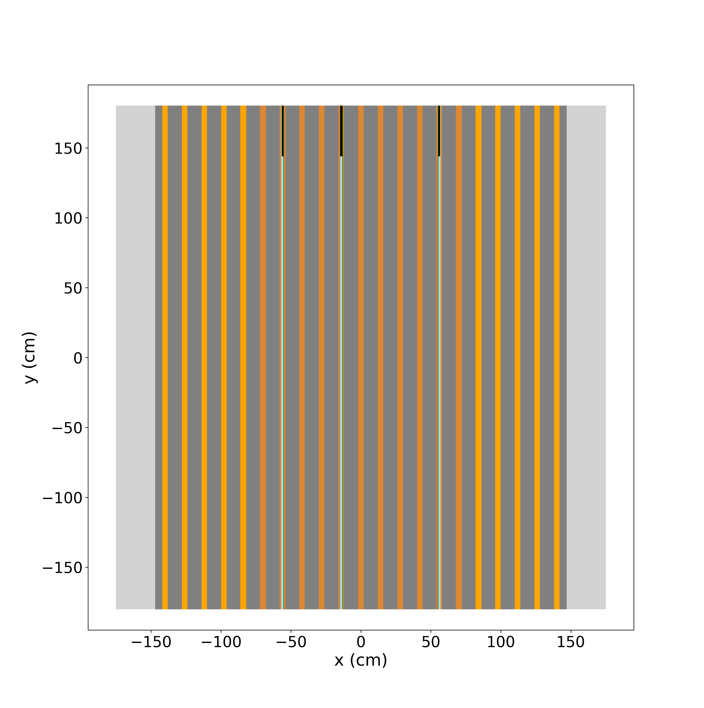
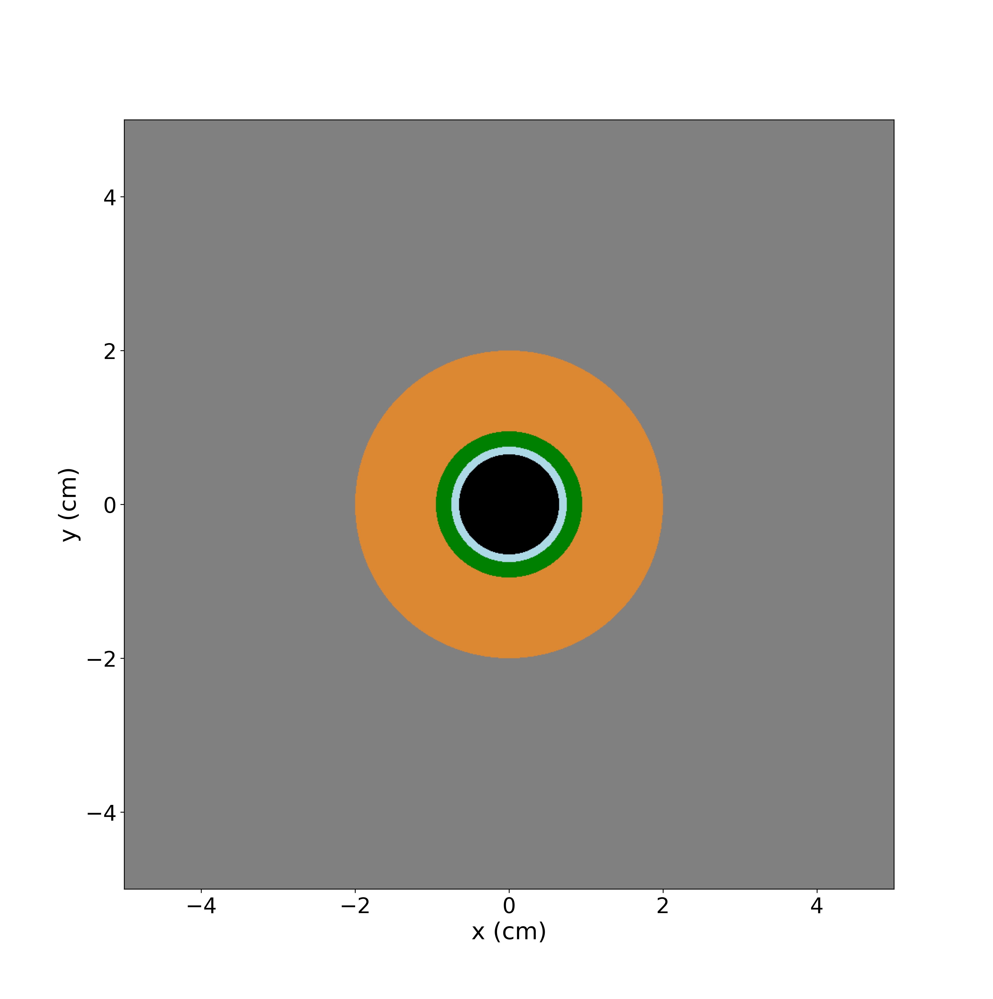

# Model geometry

The reactor core, its lateral section, and the control rod channel.
{ .lead }

<nav class="figure-jumps" aria-label="Geometry views" markdown>

[01 / Top view](#top-view)
[02 / Lateral view](#lateral-view)
[03 / Control rod](#control-rod-channel)

</nav>

## Top view { #top-view }

<figure class="technical-figure" markdown>

[{ width="3870" height="3896" }](assets/images/geometry-xy.png){ .zoomable }

<figcaption markdown>

**Figure 1.** Top view of the reactor core. The orange regions indicate the two types of fuel channels, which operate at different fuel velocities. The dark grey regions represent the graphite moderator, while the light grey regions correspond to the graphite reflector. The nine control rods and their positions are also visible, with the absorbers shown in black.

</figcaption>
</figure>

[Download top view ↓](assets/images/geometry-xy.png){ .figure-download download="gfmr-top-view.png" }

## Lateral view { #lateral-view }

<figure class="technical-figure" markdown>

[{ width="3870" height="3896" loading="lazy" }](assets/images/geometry-xz.png){ .zoomable }

<figcaption markdown>

**Figure 2.** Lateral view of the reactor. The control rods, shown in black, are inserted to a depth of 36 cm. The remaining portions inside the guide tubes are filled with helium, shown in light blue.

</figcaption>
</figure>

[Download lateral view ↓](assets/images/geometry-xz.png){ .figure-download download="gfmr-lateral-view.png" }

## Control rod channel { #control-rod-channel }

<figure class="technical-figure" markdown>

[{ width="3870" height="3896" loading="lazy" }](assets/images/control-rod.png){ .zoomable }

<figcaption markdown>

**Figure 3.** Zoomed view of the control-rod hexagon: the hafnium absorber is shown in black, the helium gap in light blue, the Hastelloy N guide tube in green, the FUNaK salt in orange, and the graphite in grey.

</figcaption>
</figure>

[Download control rod detail ↓](assets/images/control-rod.png){ .figure-download download="gfmr-control-rod.png" }

See the [control rod channel dimensions](parameters.md#control-rod-channel-geometry) and [material definitions](materials.md).
